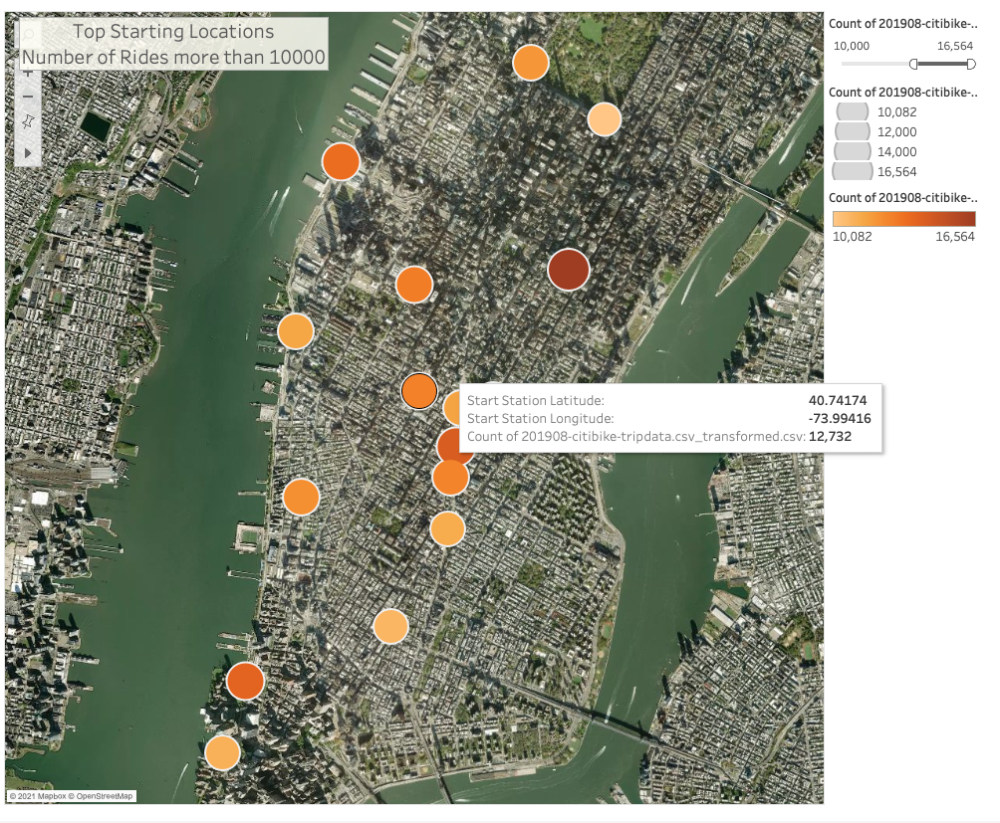

# bikesharing

## Analysis Overview

This analysis offers the investors of the bike-sharing program an insight to the bike trips in NYC. The analysis present the findings as follows:

1. Top start location for bike trips
2. Top ending location for bike trips
3. length of time that bikes are checked out for all riders and genders
4. number of bike trips for all riders and genders for each hour of each day of the week
5. number of bike trips for each type of user and gender for each day of the week.

## Data Resources:
- Citi Bike Dataset for Aug 2019 (https://s3.amazonaws.com/tripdata/index.html)

## Softwares: 
- Python 3
- Jupyter Notebook
- Tableau

## Results:

### Tableau Dashbaord online:
[link to dashboard](https://public.tableau.com/app/profile/mohammad.ali.sakhi/viz/BikeSharingNYC/Story1)

### Checkout Time 

### Checkout Time by Gender

### Trips by Type of User

### Trips by Weekdays

### Trips by Weekdays and Gender

### Top starting Locations

### Top Ending Locations

